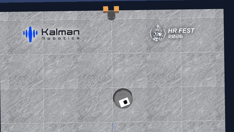
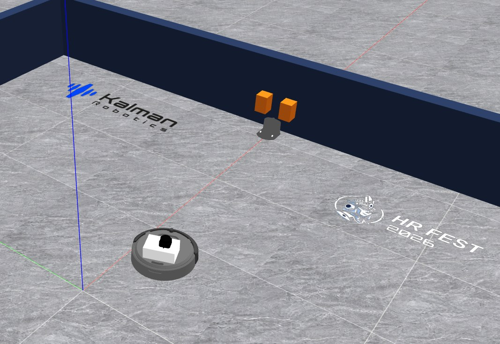
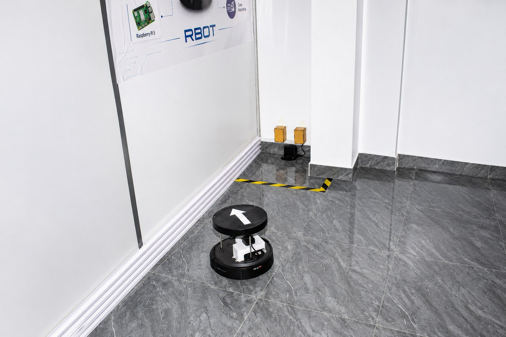
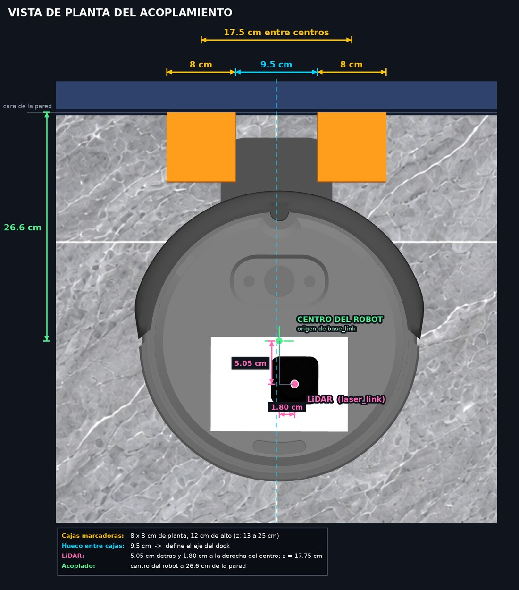
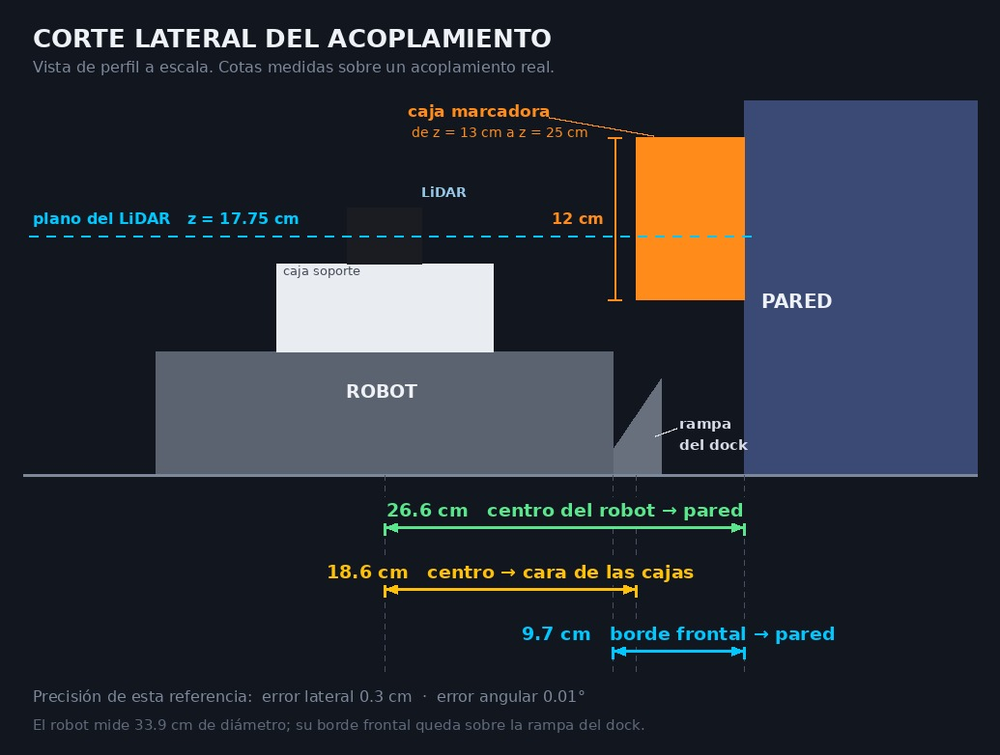
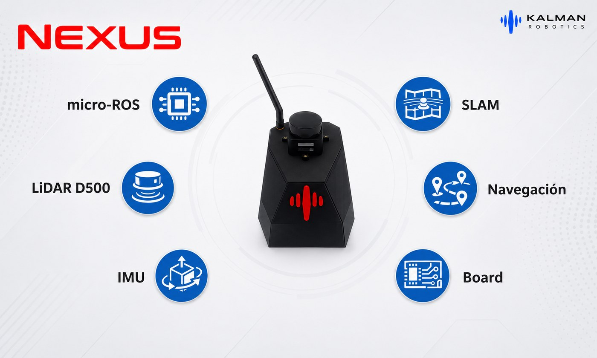

# Create 3 Dock Challenge

**Lleva un robot de vuelta a su estación de carga usando únicamente el LiDAR.**

Escenario de simulación en ROS 2 Humble + Gazebo Classic para resolver el
docking autónomo de un **iRobot Create 3** sin usar sus sensores infrarrojos ni
la acción `/dock` que trae de fábrica.

Categoría oficial del **HRFEST 2026** · Organiza **Kalman Robotics**
🔗 [Bases y registro](https://hrfest.org/congress/2026/competitions) ·
📅 Cierre: **20 de septiembre de 2026**

---

## El objetivo

Escribir un nodo de ROS 2 que, desde cualquier posición de la sala, lleve al
robot hasta su dock y lo acople —**usando solo el LiDAR** (`/scan`)— hasta que
`/dock_status` reporte `is_docked: true`.

El robot **no ve el dock**. Ve dos cajas marcadoras montadas en la pared detrás
de él, y de ellas deduce dónde acoplarse. Ese es el problema.

---

## El resultado esperado



*Solución de referencia (×2). El robot detecta el marcador y va corrigiendo su
rumbo continuamente mientras avanza, refinando la estimación del eje del dock
con cada nueva lectura del LiDAR hasta acoplarse.*

---

## Empezar

```bash
# 1. Instala (ver detalle desplegable más abajo)
cd ~/sim_ws && colcon build --symlink-install && source install/setup.bash

# 2. Lanza el escenario
ros2 launch create3_dock_challenge challenge_world.launch.py

# 3. En otra terminal, comprueba que el robot publica
ros2 topic hz /scan
ros2 topic echo /dock_status
```

| | |
|---|---|
| **Objetivo** | Que `/dock_status` reporte `is_docked: true` |
| **Puedes leer** | `/scan`, `/tf`, `/odom`, `/imu`, `/dock_status` |
| **Mueves el robot con** | `/cmd_vel` |
| **Prohibido** | La acción `/dock`, los sensores IR, el ground truth del simulador |
| **Entrega** | Código + video, hasta el **20 de septiembre de 2026** |
| **Premios** | Kit NEXUS, LiDAR D500, trofeo y suscripciones Pro |

---

## El reto en detalle

<details>
<summary><b>🤖 Por qué este problema</b></summary>

<br>

El **iRobot Create 3** es la plataforma educativa construida sobre la base
mecánica de los **Roomba** (serie i3). Como cualquier aspiradora doméstica,
viene con una estación de carga a la que vuelve solo cuando se queda sin
batería.

En su firmware eso se resuelve con **infrarrojos**: el dock emite haces
codificados (*red buoy*, *green buoy*, *force field*) que el robot lee por
`/ir_opcode`. Todo empaquetado detrás de una acción que cualquiera puede llamar:

```bash
ros2 action send_goal /dock irobot_create_msgs/action/Dock "{}"
```

Una línea, y el robot se acopla solo.

**En este reto esa acción está prohibida**, igual que los sensores IR y
cualquier atajo del simulador. Tienes que resolverlo con el LiDAR.

Es el mismo problema que aparece en robótica de servicio real cuando el
fabricante no te da el docking hecho: **una firma geométrica conocida en el
entorno + un sensor de rango + control**.

</details>

<details>
<summary><b>🗺️ El escenario</b></summary>

<br>

Una sala cerrada de ~6 × 4 m. Al fondo, una pared; contra la pared, dos cajas
separadas por un hueco; al pie de las cajas, centrado en el hueco, el dock.



*El robot arranca lejos del dock, descentrado y girado. Las dos cajas naranjas
son el marcador; el dock está al pie, centrado en el hueco.*

### Vista superior

```
    y ↑
        ┌─────────────────────────────────────────────────────┐  y = +1.95
        │                                                     │
        │                                                 ▓▓  │  caja izquierda
        │                                                 ░░  │  ← hueco 9.5 cm
        │     ●──▸  robot                                 ▓▓  │  caja derecha
        │     (0.41, −0.18)  yaw 20.6°                  ▐DOCK▌│
        │                                                     │
        │            |←────────  1.45 m  ────────→|           │
        └─────────────────────────────────────────────────────┘  y = −1.95
    x = −3.95                                    x=1.85    x=1.95 →  x
                                                  dock     pared
```

### ✅ Medidas que SÍ debes usar

Son las dimensiones del marcador. Tu código las necesita para reconocer la
firma y descartar falsos positivos. Son **relativas**: valen desde cualquier
posición de la sala.

| Medida | Valor |
|---|---|
| Cajas marcadoras | **8 × 8 × 12 cm** |
| Cuánto sobresalen de la pared | **8 cm** |
| Hueco libre entre las dos cajas | **9.5 cm** |
| Separación entre centros de caja | **17.5 cm** |
| Altura de las cajas sobre el suelo | de **13 cm** a **25 cm** |
| Altura del plano de escaneo del LiDAR | **17.75 cm** |

> **El eje del dock es el centro del hueco entre las cajas.** Si encuentras el
> hueco, encontraste el dock.

### ❌ Coordenadas del mundo — solo para entender la escena

**No las escribas en tu código.** Están aquí para que interpretes el diagrama,
nada más. La evaluación se corre desde poses iniciales distintas.

| Elemento | Posición |
|---|---|
| Dock | x = 1.85, y = 0.0, yaw = π |
| Centro de cada caja | x = 1.9095, y = ±0.0875 |
| Pared de fondo | cara interior en x = 1.95 |
| Paredes laterales | cara interior en y = ±1.95 |
| Pose inicial por defecto | x = 0.4113, y = −0.1825, yaw = 0.3601 rad |
| Distancia inicial al dock | ≈ 1.45 m |

</details>

<details>
<summary><b>📡 El LiDAR — léelo antes de escribir código</b></summary>

<br>

Un **Slamtec RPLIDAR C1** sobre una caja soporte de 16 × 11 × 6.5 cm en la tapa
del robot, replicando el montaje físico del laboratorio.



*El escenario de la simulación no es inventado: reproduce este montaje.*

| Parámetro | Valor |
|---|---|
| Tópico | `/scan` (`sensor_msgs/LaserScan`) |
| Frame | `laser_link` |
| Frecuencia | 10 Hz |
| Muestras | **720** (0.5° de resolución) |
| Rango angular | −π a +π (**360°**) |
| `angle_increment` | 0.0087388 rad |
| Alcance | 0.15 m – 12.0 m |
| Ruido gaussiano | σ = 1 mm |
| Altura del plano de escaneo | **z = 0.1775 m** |
| Posición respecto al centro | **5.05 cm detrás**, **1.80 cm a la derecha** |

### ⚠️ Tres cosas que te van a morder

**1. El LiDAR no está en el centro del robot.** Va 5.05 cm por detrás y 1.80 cm
descentrado (`base_link` → `laser_link`: `x = −0.050502`, `y = −0.017960`).
Si tratas las lecturas como si salieran del centro, tu estimación del eje irá
desplazada.

**2. Está montado girado 180°** (`yaw = 3.14`), igual que en el robot real.
**`ranges[0]` NO apunta hacia adelante**, apunta hacia atrás.

**3. La altura importa.** El plano de escaneo está a 0.1775 m y las cajas van de
0.13 a 0.25 m: el láser las corta a media altura. Por debajo de 0.13 dejarías de
verlas.

> **La solución a 1 y 2 es la misma: usa TF.** Transforma de `laser_link` a
> `base_link` y los dos problemas desaparecen.

</details>

<details>
<summary><b>📊 Qué firma ve el LiDAR</b></summary>

<br>

Esto es lo que hay que buscar en el `/scan`. Barriendo el fondo de la sala, el
perfil de distancias tiene esta forma:

```
  distancia
  medida ▲
         │
  1.95 m ┤ ─────────────┐             ┌───────────────    ← pared de fondo
         │              │             │
         │              │   9.5 cm    │
  1.87 m ┤              └─────────────┘                   ← cara frontal
         │                 ▲                                de las cajas
         │              caja  hueco  caja
         └──────────────────────────────────────────►  y
                              ▲
                    eje del dock (centro del hueco)
```

**Dos escalones de ~8 cm de ancho que sobresalen ~8 cm sobre el fondo,
separados por un hueco de 9.5 cm por donde se ve la pared.**

Esa firma es única en la sala: ninguna otra pared la produce. Detectarla de
forma estable a distintas distancias y ángulos —sin confundirla con ruido ni con
las esquinas— es el núcleo del reto.

</details>

<details>
<summary><b>🎯 Criterio de éxito — cuándo cuenta como acoplado</b></summary>

<br>



**Centrado en el hueco y perpendicular a la pared**, con los contactos sobre la
rampa del dock. Esa simetría es exactamente la **precisión** que se puntúa.

### Las cotas del acoplamiento

Medidas sobre un acoplamiento real en la simulación, no estimadas:



| Distancia | Valor |
|---|---|
| Centro del robot → pared de fondo | **26.6 cm** |
| Centro del robot → cara frontal de las cajas | **18.6 cm** |
| Centro del robot → origen del dock | **16.6 cm** |
| Borde frontal del robot → pared de fondo | **9.7 cm** |

El Create 3 mide **33.9 cm de diámetro**, así que su borde frontal queda sobre
la rampa mientras su centro se detiene a ~26.6 cm de la pared.

> **Úsalo como comprobación, no como objetivo.** No lo hardcodees: tu robot no
> sabe dónde está la pared, tiene que deducirlo del LiDAR.

### Las tres condiciones

El dock lleva un emisor IR y el robot un receptor. Se marca `is_docked: true`
cuando se cumplen **las tres a la vez**:

| # | Condición | Umbral |
|---|---|---|
| 1 | Distancia entre receptor y emisor | menos de **7.5 cm** |
| 2 | El robot está sobre el eje del dock | dentro de **±6°** |
| 3 | El robot apunta al dock | dentro de **±6°** |

*(Del código del simulador: `DOCKED_DISTANCE = 0.075 m`, `DOCKED_YAW = π/30`.)*

**Traducido:**

- 🎯 **Alineación.** No basta con mirar al dock: hay que estar **sobre su eje**.
  A la distancia de acoplamiento, ±6° son **menos de ~8 mm** de desviación
  lateral. Ese margen no se improvisa en el último tramo: hay que ir corrigiendo
  el error lateral durante toda la aproximación, para llegar ya centrado.
- 📏 **Distancia.** El centro del robot debe llegar a **menos de 26.8 cm de la
  pared**. Más lejos, no engancha.

> El margen es estrecho: la corrida de referencia acabó a **7.29 cm** — 2 mm
> dentro del umbral. **Quedarse corto es el fallo más común.**

### Cómo comprobarlo

```bash
ros2 topic echo /dock_status --field is_docked
```

</details>

---

## Instalación y uso

<details>
<summary><b>💻 Requisitos e instalación</b></summary>

<br>

| | |
|---|---|
| Sistema | **Ubuntu 22.04** (nativo, WSL2 o Docker) |
| ROS | **ROS 2 Humble** |
| Simulador | **Gazebo Classic 11** (no Ignition / Gazebo Sim) |
| RAM | 8 GB recomendado, 4 GB mínimo |
| Disco | 15 GB libres |
| GPU | No necesaria |

Con 4 GB, lanza siempre con `use_gazebo_gui:=false`: sin la ventana de Gazebo el
consumo baja mucho.

### 🪟 ¿Estás en Windows? No necesitas formatear

**WSL2 funciona perfectamente** — el escenario y las imágenes de este README se
prepararon sobre WSL2.

```powershell
# En PowerShell como administrador
wsl --install -d Ubuntu-22.04
```

Reinicia, abre "Ubuntu 22.04", crea tu usuario y sigue los pasos de abajo.
Gazebo y RViz se abren solos gracias a WSLg.

<details>
<summary>Si tu Windows no trae WSLg (Windows 10 antiguo)</summary>

Comprueba con `winver`. Si es anterior a la build 19044:

- **Actualiza Windows** hasta 19044 o superior, y `wsl --update`.
- **O trabaja headless:** lanza con `use_gazebo_gui:=false` y depura con
  `ros2 topic echo /scan`. Es viable: no necesitas ver Gazebo para resolverlo.

</details>

### Pasos

```bash
# 1. ROS 2 Humble y herramientas de build
sudo apt update
sudo apt install -y ros-humble-desktop \
                    python3-colcon-common-extensions \
                    python3-rosdep

# 2. Inicializa rosdep (solo la primera vez)
sudo rosdep init 2>/dev/null; rosdep update

# 3. Clona el reto
mkdir -p ~/sim_ws/src && cd ~/sim_ws/src
git clone https://github.com/Kalman-Robotics/create3_dock_challenge.git

# 4. rosdep instala TODO lo demas: Gazebo, los paquetes del Create 3, xacro...
cd ~/sim_ws
source /opt/ros/humble/setup.bash
rosdep install --from-paths src --ignore-src -r -y

# 5. Compila
colcon build --symlink-install
source install/setup.bash
```

> **No hace falta clonar `create3_sim`.** Los paquetes de la simulación oficial
> del Create 3 están publicados en apt, y `rosdep install` los instala solos a
> partir del `package.xml` de este repo.

### Verificación

```bash
ros2 launch create3_dock_challenge challenge_world.launch.py
```

Deberías ver Gazebo con el robot, las dos cajas y el dock, y RViz con el
LaserScan. En otra terminal:

```bash
ros2 topic hz /scan          # ~10 Hz
ros2 topic echo /dock_status --once
```

</details>

<details>
<summary><b>🚀 Cómo lanzar la simulación</b></summary>

<br>

```bash
ros2 launch create3_dock_challenge challenge_world.launch.py
```

### Argumentos que te interesan

Solo estos. El resto tiene valores calibrados y **no debes cambiarlos**: la
evaluación se corre siempre con los valores por defecto.

| Argumento | Por defecto | Para qué |
|---|---|---|
| `x`, `y`, `yaw` | `0.4113`, `-0.1825`, `0.3601` | **Pose inicial.** Cámbiala para probar desde otras posiciones — así se te evaluará. |
| `use_rviz` | `true` | RViz con LaserScan y TF ya configurados. |
| `visualize_lidar` | `false` | Dibuja el haz del LiDAR en Gazebo. Muy útil al principio. |
| `use_gazebo_gui` | `true` | `false` para correr sin ventana (más rápido al iterar). |

```bash
# Ver qué golpea el láser
ros2 launch create3_dock_challenge challenge_world.launch.py visualize_lidar:=true

# Probar desde otra pose inicial
ros2 launch create3_dock_challenge challenge_world.launch.py x:=0.9 y:=0.7 yaw:=-1.2

# Sin ventana, para iterar rápido
ros2 launch create3_dock_challenge challenge_world.launch.py use_gazebo_gui:=false
```

<details>
<summary>Otros argumentos (internos — no los uses para el reto)</summary>

`lidar_z`, `lidar_x`, `lidar_y`, `lidar_yaw`, `lidar_noise`, `safety_override`,
`visualize_rays`, `spawn_dock`, `world_path`, `namespace`.

Existen para calibrar el montaje contra el robot real. Cambiarlos altera el
problema: `lidar_noise:=0.0` te da un sensor perfecto que no tendrás en la
evaluación, y `lidar_z` por debajo de 0.13 hace que el láser deje de ver las
cajas. Documentados en `launch/create3_lidar.launch.py`.

</details>

### Limpiar entre corridas

Gazebo y los nodos de ROS sobreviven a un Ctrl-C mal dado, y las instancias
huérfanas causan fallos confusos. **Antes de cada lanzamiento:**

```bash
ros2 run create3_dock_challenge clean_sim.sh
```

(El launch aborta con un mensaje claro si detecta una simulación ya corriendo.)

</details>

<details>
<summary><b>🔒 Qué puedes usar y qué no</b></summary>

<br>

### ✅ Permitido

| Interfaz | Tipo | Para qué |
|---|---|---|
| `/scan` | `sensor_msgs/LaserScan` | **Tu única fuente de percepción del entorno.** |
| `/cmd_vel` | `geometry_msgs/Twist` | Comandar velocidad al robot. |
| `/tf`, `/tf_static` | `tf2_msgs/TFMessage` | Transformaciones entre frames. |
| `/dock_status` | `irobot_create_msgs/DockStatus` | Verificar si lograste acoplarte. |
| `/odom` | `nav_msgs/Odometry` | Odometría. Permitida, pero deriva. |
| `/imu` | `sensor_msgs/Imu` | IMU del robot. |
| `/battery_state` | `sensor_msgs/BatteryState` | Estado de la batería. |
| `/hazard_detection` | `irobot_create_msgs/HazardDetectionVector` | Detección de choques. |

### ❌ Prohibido — descalifica

| Interfaz | Por qué |
|---|---|
| **Acción `/dock`** | Es literalmente el problema que debes resolver. |
| `/navigate_to_position`, `/drive_distance`, `/rotate_angle`, `/drive_arc`, `/wall_follow` | Comportamientos ya resueltos por iRobot. Usa `/cmd_vel`. |
| `/ir_opcode`, `/ir_intensity` | Son los sensores infrarrojos de docking. |
| `/sim_ground_truth_pose`, `/sim_ground_truth_dock_pose` | Posición exacta regalada por el simulador. |
| `/gazebo/model_states`, `/gazebo/link_states`, servicios `/gazebo/*` | Estado interno del simulador. |
| Frame TF `std_dock_link` | Ver la advertencia abajo. |

> ### ⚠️ Trampa: el frame `std_dock_link`
>
> El nodo oficial del Create 3 publica un TF estático `odom → std_dock_link`
> que **en este escenario es incorrecto**: reporta el dock a 0.157 m del origen
> de odometría, cuando el dock real está a ~1.45 m. **Ignóralo.**

> ### ⚠️ Prohibido hardcodear
>
> No puedes escribir en tu código la posición del dock, la pose inicial, ni una
> secuencia fija de movimientos. Tu solución debe **percibir** dónde está el
> dock. Se evalúa desde poses que no conoces.

</details>

<details>
<summary><b>💡 Pistas — cómo abordarlo</b></summary>

<br>

**Piensa en lazo cerrado, no en una secuencia de pasos.** El LiDAR te da 10
lecturas por segundo: la idea no es detectar una vez y ejecutar un plan, sino
**re-detectar y corregir continuamente** mientras te acercas. Cuanto más cerca
estás, más puntos caen sobre las cajas y mejor es tu estimación del eje.

Un esqueleto que funciona:

1. **Búsqueda.** El robot puede arrancar mirando a cualquier lado. Gira sobre su
   eje hasta que la firma aparezca en el `/scan`.
2. **Aproximación controlada.** En cada ciclo: detecta el marcador, calcula el
   eje del dock y la **normal** de la pared, y de ahí saca dos errores —lateral
   (cuánto te separas del eje) y angular (cuánto te desvías de la
   perpendicular)—. Corrige ambos mientras avanzas. Con eso el robot converge
   sobre el eje solo, sin necesidad de alinearse primero y avanzar después.
3. **Acoplamiento.** Cerca del dock baja la velocidad y aprieta las tolerancias.
   Sigue corrigiendo hasta que `is_docked` sea `true`.

> **Alinearse antes de entrar** (girar en el sitio y luego avanzar recto)
> también funciona y es más fácil de programar, pero es frágil: cualquier
> deslizamiento durante el avance ya no se corrige. Corregir de forma continua
> es lo que da precisión —y lo que puntúa.

**Detalles que marcan la diferencia:**

- **Trabaja en coordenadas cartesianas, no en índices del array.** Convierte
  cada `range[i]` a (x, y) con `angle_min + i * angle_increment` y transforma a
  `base_link` vía TF. Así el montaje invertido deja de ser un problema.
- **Segmenta por saltos de distancia.** Un salto grande entre muestras
  consecutivas es un borde. Los bordes de las cajas son tus features.
- **Valida con las medidas conocidas.** Acepta un candidato solo si el hueco
  mide ~9.5 cm y los escalones sobresalen ~8 cm. Descarta ruido y esquinas.
- **Ajusta una recta** a la pared del fondo para obtener su normal de forma
  robusta (mínimos cuadrados o RANSAC).
- **Filtra en el tiempo.** No confíes en una sola detección.
- **Control proporcional simple** sobre error lateral y angular suele bastar.
- **El final es lento.** El dock tiene rampa: si entras rápido o torcido,
  rebotas. Baja a ~2 cm/s en los últimos centímetros.
- **Piensa en la recuperación.** Si pierdes las cajas a media aproximación,
  ¿qué haces? Los puntos de robustez están ahí.
- **Depura visualmente.** Publica tus detecciones como
  `visualization_msgs/Marker` y míralas en RViz.

</details>

<details>
<summary><b>🔧 Problemas frecuentes</b></summary>

<br>

**"YA HAY UNA SIMULACION CORRIENDO"**
Hay un `gzserver` vivo de un lanzamiento anterior:
```bash
ros2 run create3_dock_challenge clean_sim.sh
```

**El robot no se mueve al publicar en `/cmd_vel`**
Verifica que `safety_override` se haya aplicado:
```bash
ros2 param get /motion_control safety_override    # debe decir 'full'
```
Además, el Create 3 se detiene si no recibe comandos continuamente: publica a
10–20 Hz, no una sola vez.

**Gazebo tarda muchísimo en cargar**
Suele ser Gazebo intentando descargar modelos de internet. El launch ya
desactiva la base de datos remota; asegúrate de haber hecho `source` del
`install/setup.bash` de **este** workspace.

**El robot sale inclinado o las ruedas saltan en RViz**
Casi siempre son procesos huérfanos: dos `robot_state_publisher` compitiendo.
Corre `clean_sim.sh` y relanza.

**No veo las cajas en el `/scan`**
Comprueba que `lidar_z` sea 0.1775 (por defecto). Para verlo:
```bash
ros2 launch create3_dock_challenge challenge_world.launch.py visualize_lidar:=true
```

**Mi detección funciona pero el robot se acopla torcido**
Llegas bien en posición y mal en orientación. Necesitas la **normal** de la
pared, no solo el centro del hueco.

</details>

---

## Concurso

<details>
<summary><b>📅 Cronograma</b></summary>

<br>

| Hito | Fecha |
|---|---|
| Apertura de inscripciones | 02 de julio de 2026 |
| **Cierre de envíos** | **20 de septiembre de 2026, 23:59 (Perú)** — impostergable |
| Resultados Top 8 | 30 de septiembre de 2026 |
| **Gran Final presencial** | **viernes 06 de noviembre de 2026, 14:00–16:00** |

**🖥️ Clasificatoria — hasta el 20 de septiembre.** Resuelves el docking en
simulación desde tu casa. Es todo lo que describe este README.

**🤖 Gran Final — 6 de noviembre.** Los 8 finalistas despliegan su código en un
**iRobot Create 3 real**. Y quien complete la clasificatoria —aunque no entre al
Top 8— obtiene **acceso al laboratorio** para prepararse sobre ese robot, más un
mes gratis de la plataforma.

</details>

<details>
<summary><b>📏 Reglas</b></summary>

<br>

1. **Equipos de hasta 5 integrantes**, multidisciplinarios. También se admite
   participación individual.
2. **Divisiones por edad:** menores de 18 (división escolar, exhibición y
   menciones) y mayores de 18 (competencia oficial por el podio).
3. **Lenguaje libre** dentro de ROS 2 Humble: `rclpy` o `rclcpp`.
4. **Librerías libres** (NumPy, SciPy, scikit-learn, OpenCV…), declaradas en el
   `package.xml` / `requirements.txt`.
5. **Prohibido modificar este paquete.** Tu solución va en tu propio paquete.
6. **Prohibido usar las interfaces de la lista negra.** Se revisa el código y se
   monitorean las suscripciones.
7. **Prohibido hardcodear** poses, distancias o secuencias fijas.
8. **Un único comando de lanzamiento**, documentado en tu README.
9. **Límite de 180 segundos por corrida.**
10. **El código debe ser original.** Puedes citar literatura, no copiar
    soluciones al reto.
11. **Fecha límite impostergable:** 20 de septiembre de 2026, 23:59 (Perú).
12. **Asistencia presencial obligatoria para el Top 8.** Quien no asista recibe
    solo certificado digital.

📋 Reglamento completo y vinculante:
**[hrfest.org](https://hrfest.org/congress/2026/competitions)**

</details>

<details>
<summary><b>📊 Cómo se evalúa</b></summary>

<br>

**El jurado ejecuta tu solución en 3 corridas desde poses que no conoces**,
sorteadas dentro de:

```
x   ∈ [0.0,  1.3]   m
y   ∈ [−0.9, 0.9]   m
yaw ∈ [−π,   π]     rad     (puedes arrancar de espaldas al dock)
```

Con los valores por defecto del launch, incluido el ruido del LiDAR (σ = 1 mm).
Límite de **180 s por corrida**.

### Rúbrica — 100 puntos

| Criterio | Puntos | Cómo se mide |
|---|---:|---|
| **🎯 Llegar al dock** | **50** | ~17 pts por corrida con `is_docked: true` dentro de 180 s. Sin acoplar, el resto vale 0. |
| **⏱️ Tiempo** | **25** | Promedio de las exitosas. ≤ 45 s → 25 pts; escala lineal hasta 180 s → 0. |
| **📐 Precisión** | **25** | Error lateral y angular al acoplarte, medidos con el ground truth. |

### Penalizaciones

| Falta | Efecto |
|---|---|
| Golpear cajas, dock o pared | −10 pts por corrida |
| Usar una interfaz prohibida | **Descalificación** |
| Hardcodear pose o trayectoria | **Descalificación** |
| Modificar `create3_dock_challenge` | **Descalificación** |
| No compila / no arranca | **Descalificación** |
| Video con cortes en la corrida | **Descalificación** |

**Desempate:** más corridas exitosas → menor tiempo → menor error lateral.

</details>

<details>
<summary><b>🏆 Premios</b></summary>

<br>

| Puesto | Premio |
|---|---|
| **1er lugar** | 🏆 Trofeo · certificado físico · **Kit NEXUS completo** · 3 meses de suscripción Pro |
| **2do lugar** | 🥈 Medalla · certificado físico · **LiDAR Waveshare D500** · 3 meses de suscripción Pro |
| **3er lugar** | 🥉 Medalla · certificado físico · 3 meses de suscripción Pro |
| **Top 8** | Certificado virtual · acceso al laboratorio |

Las suscripciones Pro son individuales, hasta 3 integrantes por equipo.

### 🤖 Kit NEXUS — primer puesto



Robot móvil diferencial de Kalman Robotics, **14 × 10 × 8 cm**:

| Componente | |
|---|---|
| **Placa electrónica** | Controladora propia con **micro-ROS** integrado |
| **Motores con encoders** | Tracción diferencial con odometría |
| **IMU** | Orientación y estimación de pose |
| **LiDAR D500** | Escaneo 360° para SLAM y navegación |

Sale de la caja listo para SLAM y navegación autónoma. Es el siguiente paso
después de este reto.

### 📡 LiDAR Waveshare D500 — segundo puesto

El mismo sensor que monta el NEXUS. DTOF 360°, compatible con ROS 2.

| Parámetro | Valor |
|---|---|
| Rango | 0.03 – 12 m |
| Muestreo | 5000 Hz · escaneo 10 Hz |
| Resolución angular | ≤ 0.72° |
| Precisión | 10 mm (0.3–0.5 m) · 20 mm (0.5–2 m) · 30 mm (2–12 m) |
| Interfaz | UART @ 230400 bps · 5 V |

📄 [Documentación oficial](https://www.waveshare.com/wiki/D500_LiDAR_Kit)

### 🔧 Y además, por completar el reto

Aunque no entres al Top 8:

- **Acceso al laboratorio de Kalman Robotics** para preparar la final con el
  Create 3 real.
- **Un mes gratis de la plataforma**, uno por integrante.

> *El pozo de premios puede ampliarse con aportes de patrocinadores.*
> *[hrfest.org](https://hrfest.org/congress/2026/competitions) es la fuente
> vinculante.*

</details>

<details>
<summary><b>📤 Cómo entregar</b></summary>

<br>

### Fase 1 — Inscripción

Registra a tu equipo en la página oficial. Recibirás por correo un **Código
Único de Competidor**, obligatorio para la Fase 2.

👉 https://hrfest.org/congress/2026/competitions

### Fase 2 — Entregables

**1. Tu código:** repositorio público de GitHub o carpeta de Drive.

Con GitHub, indica el **hash del commit** a evaluar. Con Drive, entrega el
paquete comprimido y no lo modifiques tras el cierre. El enlace debe abrirse sin
pedir permisos.

Solo tu paquete: **no incluyas** copias de `create3_dock_challenge` ni
`create3_sim`, ni `build/`, `install/`, `log/`.

Tu `README.md` debe llevar: nombres y correos del equipo, comandos de
instalación y build, **el comando único de lanzamiento**, explicación del
algoritmo y limitaciones conocidas.

```
mi_solucion_dock/
├── package.xml
├── setup.py                    (o CMakeLists.txt si usas C++)
├── README.md
├── launch/
│   └── solucion.launch.py      ← el comando único
└── mi_solucion_dock/
    └── dock_lidar.py           ← tu nodo
```

```bash
# Terminal 1: el escenario del reto (sin tocar)
ros2 launch create3_dock_challenge challenge_world.launch.py

# Terminal 2: TU comando único
ros2 launch mi_solucion_dock solucion.launch.py
```

Tu nodo debe empezar a trabajar solo al lanzarse.

**2. Video demostrativo.**

| Requisito | |
|---|---|
| Duración | máximo 5 minutos |
| Grabación | La **corrida en toma continua**, del arranque hasta `is_docked: true` |
| Contenido | La simulación corriendo y, si quieres, tu código en pantalla |
| Idioma | Español o inglés |

Puedes añadir presentación o cierre. Lo único que no se edita es la corrida.

**3. Enlace público del video** (YouTube, Drive o similar).

### Antes de enviar

Clona tu repo limpio en un workspace nuevo y comprueba que compila y arranca.
**Si no corre en la máquina del jurado, no se evalúa.**

</details>

---

## Contacto

- **Organiza:** Kalman Robotics — categoría oficial del HRFEST 2026
- **Bases generales y registro:** https://hrfest.org/congress/2026/competitions
- **Dudas técnicas:** abre un *issue* en este repositorio
- **Correo:** alaurao@uni.pe

Buena suerte 🤖⚡

---

## Licencia

Apache-2.0. Ver [`LICENSE`](LICENSE).

El modelo del iRobot Create 3 y su simulación provienen de
[`create3_sim`](https://github.com/iRobotEducation/create3_sim) (Apache-2.0,
iRobot Corporation).
