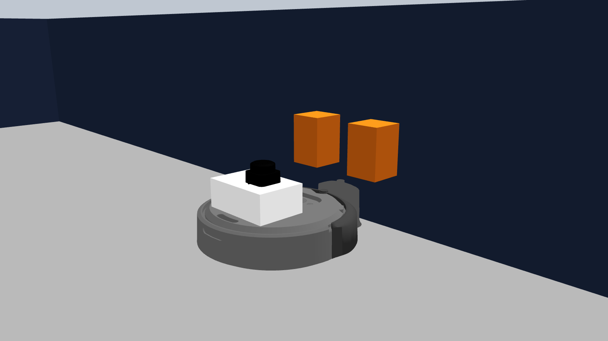

# Create 3 Dock Challenge — Kalman Robotics @ HR Fest

**Lleva un robot de vuelta a su estación de carga usando únicamente el LiDAR.**

Categoría oficial del **HRFEST 2026**, organizada por Kalman Robotics.
Bases y registro: **https://hrfest.org/congress/2026/competitions**

**Etapa clasificatoria — cierre: 20 de septiembre de 2026, 23:59 (hora de Perú).**

> **Resuélvelo en simulación y entras al laboratorio.** Todo equipo que complete
> el reto antes del cierre podrá preparar la Gran Final trabajando con el
> **iRobot Create 3 real** en el laboratorio de Kalman Robotics. La final se
> disputa sobre ese robot, no sobre el simulador.

---

## Inicio rápido

```bash
# 1. Lanza el escenario
ros2 launch create3_dock_challenge challenge_world.launch.py

# 2. En otra terminal, comprueba que el robot publica
ros2 topic hz /scan
ros2 topic echo /dock_status
```

| | |
|---|---|
| **Objetivo** | Que `/dock_status` reporte `is_docked: true` |
| **Puedes leer** | `/scan` (LiDAR), `/tf`, `/odom`, `/dock_status` |
| **Mueves el robot con** | `/cmd_vel` |
| **Prohibido** | La acción `/dock`, los sensores IR, y la posición que da el simulador |
| **Entrega** | Repo público + video sin cortes, hasta el **20 de septiembre de 2026** |
| **Si lo logras** | Acceso al **laboratorio de Kalman Robotics** para preparar la final con el robot real |
| **Final** | Top 8 el 30 de septiembre · **jueves 5 de noviembre, 14:00–16:00**, sobre el robot físico |
| **Premios** | Kit Nexus, LiDAR DFRobot, trofeo y suscripciones Pro — [ver detalle](#12-premios-y-beneficios) |

---

## Tabla de contenido

1. [El robot: iRobot Create 3](#1-el-robot-irobot-create-3)
2. [El problema](#2-el-problema)
3. [El escenario](#3-el-escenario)
4. [Qué firma ve el LiDAR](#4-qué-firma-ve-el-lidar)
5. [Instalación](#5-instalación)
6. [Cómo lanzar la simulación](#6-cómo-lanzar-la-simulación)
7. [Recursos: qué puedes usar y qué no](#7-recursos-qué-puedes-usar-y-qué-no)
8. [Criterio de éxito](#8-criterio-de-éxito)
9. [Cronograma y estructura](#9-cronograma-y-estructura)
10. [Reglas del concurso](#10-reglas-del-concurso)
11. [Evaluación y puntaje](#11-evaluación-y-puntaje)
12. [Premios y beneficios](#12-premios-y-beneficios)
13. [Cómo entregar](#13-cómo-entregar)
14. [Pistas](#14-pistas)
15. [Problemas frecuentes](#15-problemas-frecuentes)
16. [Contacto](#16-contacto)

---

## 1. El robot: iRobot Create 3

El **iRobot Create 3** es la plataforma educativa de iRobot construida sobre la
misma base mecánica de los robots aspiradores **Roomba** (serie i3). Es un robot
diferencial, con batería, y —como cualquier aspiradora doméstica— viene con una
**estación de carga (dock)** a la que debe volver por su cuenta cuando se queda
sin energía.

En su firmware, iRobot resuelve ese regreso con sensores **infrarrojos**: el dock
emite haces codificados (*red buoy*, *green buoy*, *force field*) que el robot
lee por `/ir_opcode` y usa para alinearse. Todo eso está empaquetado detrás de
una acción de ROS 2 que cualquiera puede llamar:

```bash
ros2 action send_goal /dock irobot_create_msgs/action/Dock "{}"
```

Una línea, y el robot se acopla solo.

---

## 2. El problema

**En este reto esa acción está prohibida.** También lo están los sensores IR de
docking y cualquier atajo del simulador.

> ### 🎯 Tu tarea
>
> Escribir un nodo de ROS 2 que, partiendo de una posición arbitraria de la sala,
> lleve al robot hasta su estación de carga y lo acople —**usando como única
> fuente de percepción el LiDAR** (`/scan`)— hasta que `/dock_status` reporte
> `is_docked: true`.

Para que sea posible, el montaje tiene **dos cajas marcadoras** en la pared,
detrás del dock. El robot no ve el dock: ve las dos cajas, y de ellas deduce
dónde está el dock. Ése es todo el truco, y ése es el problema que tienes que
resolver.

Es el mismo problema que resuelven los robots de servicio reales cuando el
fabricante no te da el docking hecho: **una firma geométrica conocida en el
entorno + un sensor de rango + control**.

---

## 3. El escenario

Una sala cerrada de ~6 × 4 m. Al fondo, una pared; contra la pared, dos cajas
separadas por un hueco; al pie de las cajas, centrado en el hueco, el dock.

### Vista superior

```
    y ↑
        ┌─────────────────────────────────────────────────────┐  y = +1.95
        │                                                     │
        │                                                 ▓▓  │  caja izquierda
        │                                                 ░░  │  ← hueco 9.5 cm
        │     ●──▸  robot                                 ▓▓  │  caja derecha
        │     (0.41, −0.18)  yaw 20.6°                  ▐DOCK▌│
        │                                                     │
        │            |←────────  1.45 m  ────────→|           │
        └─────────────────────────────────────────────────────┘  y = −1.95
    x = −3.95                                    x=1.85    x=1.95 →  x
                                                  dock     pared
```

### ✅ Medidas que SÍ debes usar

Son las dimensiones del marcador. Tu código las necesita para reconocer la
firma en el LiDAR y descartar falsos positivos. Son **relativas**: valen desde
cualquier posición de la sala.

| Medida | Valor |
|---|---|
| Cajas marcadoras | **8 × 8 × 12 cm** (largo × ancho × alto) |
| Cuánto sobresalen de la pared | **8 cm** |
| Hueco libre entre las dos cajas | **9.5 cm** |
| Separación entre centros de caja | **17.5 cm** |
| Altura de las cajas sobre el suelo | de **13 cm** a **25 cm** |
| Altura del plano de escaneo del LiDAR | **17.75 cm** |

> **El eje del dock es el centro del hueco entre las cajas.** Si encuentras el
> hueco, encontraste el dock.

### ❌ Coordenadas del mundo — solo para que entiendas la escena

**No las escribas en tu código.** Están aquí para que interpretes el diagrama de
arriba, nada más. La evaluación se corre desde poses iniciales distintas, así
que cualquier solución que dependa de estos números va a fallar.

| Elemento | Posición en el mundo |
|---|---|
| Dock | x = 1.85, y = 0.0, yaw = π |
| Centro de cada caja | x = 1.9095, y = ±0.0875 |
| Pared de fondo | cara interior en x = 1.95 |
| Paredes laterales | cara interior en y = ±1.95 |
| Pose inicial por defecto | x = 0.4113, y = −0.1825, yaw = 0.3601 rad (20.6°) |
| Distancia inicial al dock | ≈ 1.45 m |

### El LiDAR

Un **Slamtec RPLIDAR C1** montado sobre un mástil, replicando el montaje físico
del robot real del laboratorio.

| Parámetro | Valor |
|---|---|
| Tópico | `/scan` (`sensor_msgs/LaserScan`) |
| Frame | `laser_link` |
| Frecuencia | 10 Hz |
| Muestras | **720** (0.5° de resolución) |
| Rango angular | −π a +π (**360°**) |
| `angle_increment` | 0.0087388 rad |
| Alcance | 0.15 m – 12.0 m |
| Ruido gaussiano | σ = 1 mm (configurable) |
| Altura del plano de escaneo | **z = 0.1775 m** sobre el suelo |

⚠️ **El LiDAR está montado girado 180°** (`lidar_yaw = 3.14`), igual que en el
robot real. Eso significa que **`ranges[0]` NO apunta hacia adelante**, apunta
hacia atrás. Si asumes "índice 0 = frente" tu código se equivocará por 180°.
Usa **TF** (`base_link` ← `laser_link`) para transformar correctamente, o
compensa el yaw explícitamente.

⚠️ **La altura importa:** el plano de escaneo está a 0.1775 m y las cajas van
de 0.13 a 0.25 m. Por eso el láser las corta a media altura. Esa cota sale del
montaje real: tapa del robot (9.2 cm) + caja soporte (6.5 cm) + medio sensor
(2.05 cm). Si cambias `lidar_z` por debajo de 0.13 dejarás de ver las cajas.

---

## 4. Qué firma ve el LiDAR

Esto es lo que hay que buscar en el `/scan`. Barriendo el fondo de la sala, el
perfil de distancias que devuelve el láser tiene esta forma:

```
  distancia
  medida ▲
         │
  1.95 m ┤ ─────────────┐             ┌───────────────    ← pared de fondo
         │              │             │
         │              │   9.5 cm    │
  1.87 m ┤              └─────────────┘                   ← cara frontal
         │                 ▲                                de las cajas
         │              caja  hueco  caja
         └──────────────────────────────────────────►  y
                              ▲
                    eje del dock (centro del hueco)
```

**Dos escalones de ~8 cm de ancho que sobresalen ~8 cm sobre el fondo,
separados por un hueco de 9.5 cm por donde se ve la pared.**

Esa firma es única en la sala: ninguna otra pared la produce. Detectarla de
forma estable a distintas distancias y ángulos —y no confundirla con ruido ni
con las esquinas de la sala— es el núcleo del reto.

---

## 5. Instalación

### Requisitos

- **Ubuntu 22.04**
- **ROS 2 Humble**
- **Gazebo Classic 11** (no Ignition / Gazebo Sim)
- Paquetes de simulación oficiales del Create 3 (`create3_sim`)

### Pasos

```bash
# 1. Dependencias del sistema
sudo apt update
sudo apt install -y ros-humble-desktop \
                    ros-humble-gazebo-ros-pkgs \
                    ros-humble-xacro \
                    python3-colcon-common-extensions

# 2. Workspace
mkdir -p ~/sim_ws/src && cd ~/sim_ws/src

# 3. Simulación oficial del iRobot Create 3
git clone -b humble https://github.com/iRobotEducation/create3_sim.git

# 4. Este reto
git clone https://github.com/Kalman-Robotics/create3_dock_challenge.git

# 5. Dependencias y build
cd ~/sim_ws
rosdep install --from-paths src --ignore-src -r -y
colcon build --symlink-install
source install/setup.bash
```

### Verificación

```bash
ros2 launch create3_dock_challenge challenge_world.launch.py
```

Deberías ver Gazebo con el robot, las dos cajas y el dock. En otra terminal:

```bash
ros2 topic hz /scan          # ~10 Hz
ros2 topic echo /dock_status --once
```

---

## 6. Cómo lanzar la simulación

```bash
ros2 launch create3_dock_challenge challenge_world.launch.py
```

### Argumentos que te interesan

Solo necesitas estos cuatro. El resto tiene valores calibrados para el reto y
**no debes cambiarlos**: la evaluación se corre siempre con los valores por
defecto.

| Argumento | Por defecto | Para qué |
|---|---|---|
| `x`, `y`, `yaw` | `0.4113`, `-0.1825`, `0.3601` | **Pose inicial del robot.** Cámbiala para probar tu solución desde otras posiciones — así se te evaluará. |
| `use_rviz` | `false` | Abrir RViz para depurar. |
| `visualize_lidar` | `false` | Dibuja el haz del LiDAR en Gazebo. Muy útil para entender qué ve el sensor. |
| `use_gazebo_gui` | `true` | `false` para correr sin ventana (más rápido al iterar). |

```bash
# Depurando: RViz + haz del LiDAR visible
ros2 launch create3_dock_challenge challenge_world.launch.py \
     use_rviz:=true visualize_lidar:=true

# Probando tu solución desde otra pose inicial
ros2 launch create3_dock_challenge challenge_world.launch.py \
     x:=0.9 y:=0.7 yaw:=-1.2

# Sin ventana, para iterar rápido
ros2 launch create3_dock_challenge challenge_world.launch.py use_gazebo_gui:=false
```

<details>
<summary>Otros argumentos (internos — no los uses para el reto)</summary>

`lidar_z`, `lidar_x`, `lidar_y`, `lidar_yaw`, `lidar_noise`, `safety_override`,
`visualize_rays`, `spawn_dock`, `world_path`, `namespace`.

Existen para calibrar el montaje contra el robot real. Cambiarlos altera el
problema (por ejemplo, `lidar_noise:=0.0` te da un sensor perfecto que no
tendrás en la evaluación, y `lidar_z` por debajo de 0.13 hace que el láser deje
de ver las cajas). Están documentados en `launch/create3_lidar.launch.py`.

</details>

### Limpiar entre corridas

Gazebo y los nodos de ROS sobreviven a un Ctrl-C mal dado y las instancias
huérfanas causan fallos confusos. **Antes de cada lanzamiento:**

```bash
ros2 run create3_dock_challenge clean_sim.sh
```

(El launch aborta con un mensaje claro si detecta una simulación ya corriendo.)

---

## 7. Recursos: qué puedes usar y qué no

### ✅ Permitido

| Interfaz | Tipo | Para qué |
|---|---|---|
| `/scan` | `sensor_msgs/LaserScan` | **Tu única fuente de percepción del entorno.** |
| `/cmd_vel` | `geometry_msgs/Twist` | Comandar velocidad lineal y angular al robot. |
| `/tf`, `/tf_static` | `tf2_msgs/TFMessage` | Transformaciones entre frames (`odom`, `base_link`, `laser_link`). |
| `/dock_status` | `irobot_create_msgs/DockStatus` | Verificar si lograste acoplarte (`is_docked`). |
| `/odom` | `nav_msgs/Odometry` | Odometría de las ruedas. Permitida, pero deriva. |
| `/battery_state` | `sensor_msgs/BatteryState` | Estado de la batería. |
| `/imu` | `sensor_msgs/Imu` | IMU del robot. |
| `/hazard_detection` | `irobot_create_msgs/HazardDetectionVector` | Detección de choques (bumper). |

### ❌ Prohibido — descalifica

| Interfaz | Por qué |
|---|---|
| **Acción `/dock`** | Es literalmente el problema que debes resolver. |
| Acciones `/navigate_to_position`, `/drive_distance`, `/rotate_angle`, `/drive_arc`, `/wall_follow` | Comportamientos ya resueltos por iRobot. Mueve el robot con `/cmd_vel`. |
| `/ir_opcode`, `/ir_intensity` | Son los sensores infrarrojos de docking. El reto es hacerlo **con LiDAR**. |
| `/sim_ground_truth_pose`, `/sim_ground_truth_dock_pose` | Posición exacta regalada por el simulador. Es hacer trampa. |
| `/gazebo/model_states`, `/gazebo/link_states`, servicios `/gazebo/*` | Igual: estado interno del simulador. |
| Frame TF `std_dock_link` | Ver la advertencia abajo. |

> ### ⚠️ Trampa: el frame `std_dock_link`
>
> El nodo oficial del Create 3 publica un TF estático `odom → std_dock_link`
> que **en este escenario es incorrecto**: reporta el dock a 0.157 m del origen
> de odometría (el valor por defecto de iRobot), cuando el dock real está a
> ~1.45 m. Si lo usas, tu robot irá al lugar equivocado. **Ignóralo.**

> ### ⚠️ Prohibido hardcodear
>
> No puedes escribir en tu código la posición del dock (`x = 1.85`), la pose
> inicial del robot, ni una secuencia fija de movimientos. Tu solución debe
> **percibir** dónde está el dock. Se evaluará desde poses iniciales que no
> conoces; una solución hardcodeada fallará ahí de todos modos.

---

## 8. Criterio de éxito

### Así debe quedar el robot



El robot centrado en el hueco entre las dos cajas, perpendicular a la pared y
con los contactos apoyados en la rampa del dock. En ese momento:

```yaml
is_docked: true
```

### Cómo se comprueba

Una corrida es exitosa cuando:

```bash
ros2 topic echo /dock_status
```

reporta:

```yaml
dock_visible: true
is_docked: true      # ← esto es lo que cuenta
```

Sin haber tocado ninguna interfaz prohibida, y sin haber golpeado las cajas,
el dock ni las paredes.

Puedes verificarlo automáticamente así:

```bash
ros2 topic echo /dock_status --field is_docked
```

---

## 9. Cronograma y estructura

Este reto tiene **tres momentos**: resuelves en simulación, te preparas en el
laboratorio con el robot real, y compites en vivo sobre ese robot.

| Hito | Fecha |
|---|---|
| Apertura de inscripciones | 02 de julio de 2026 |
| **Cierre de envíos** | **20 de septiembre de 2026** (impostergable) |
| Acceso al laboratorio de Kalman Robotics | del 21 de septiembre al 4 de noviembre |
| Resultados Top 8 | 30 de septiembre de 2026 |
| **Gran Final presencial** | **jueves 05 de noviembre de 2026, 14:00–16:00, Auditorio** |

### Etapa 1 — Clasificatoria en simulación

Resuelves el docking en Gazebo desde tu casa y envías tu solución antes del
20 de septiembre. De aquí salen los **8 equipos finalistas**.

### 🔧 Beneficio — Acceso al laboratorio de Kalman Robotics

> **Todo equipo que logre completar el reto en simulación antes del 20 de
> septiembre obtiene acceso al laboratorio de Kalman Robotics**, donde podrá
> **preparar la final sobre el iRobot Create 3 real**: afinar su algoritmo,
> ajustar umbrales y comprobar cómo se comporta su detección con un LiDAR
> físico, un dock físico y un suelo real.

No es un premio simbólico: es la diferencia entre llegar a la final con código
que solo ha visto un simulador y llegar con código ya probado en hardware. El
salto de simulación a robot real es la parte más dura del reto, y este acceso
existe para que no la enfrentes por primera vez el día de la final.

### Etapa 2 — Gran Final sobre el robot real

**Jueves 05 de noviembre, 14:00 a 16:00, en el Auditorio.**

Los 8 finalistas **despliegan su código en el iRobot Create 3 físico y lo
ejecutan en vivo** delante del jurado y del público. Mismo robot, mismo LiDAR,
mismas cajas marcadoras — pero el mundo real: ruido de verdad, deslizamiento de
ruedas, deriva de odometría y una **pose de arranque que no conoces de
antemano**.

> **Por eso las reglas anti-hardcode no son un formalismo.** En la final tu
> código corre sobre una escena que no has visto, en un robot que no es el del
> simulador. Una solución que percibe se adapta; una que memoriza coordenadas
> se queda parada delante del público.

La asistencia presencial es **obligatoria** para disputar el podio. Quien
clasifique y no asista recibe únicamente el certificado digital.

---

## 10. Reglas del concurso

1. **Equipos de hasta 5 integrantes**, multidisciplinarios: pueden mezclar
   estudiantes de distintas universidades o instituciones. También se admite
   participación individual.
2. **Divisiones por edad** (política general HRFEST):
   - **Menores de 18 años:** división escolar, enfocada en exhibición,
     aprendizaje y menciones de honor.
   - **Mayores de 18 años:** competencia oficial universitaria y profesional
     por el podio absoluto.
3. **Lenguaje libre** dentro de ROS 2 Humble: Python (`rclpy`) o C++ (`rclcpp`).
4. **Librerías libres** (NumPy, SciPy, scikit-learn, OpenCV, etc.), siempre que
   se declaren en el `package.xml` / `requirements.txt` y la solución instale y
   corra con `rosdep install` + `colcon build`.
5. **Prohibido modificar este paquete.** Nada de tocar el mundo, el URDF, los
   launch ni las cajas. Tu solución va en **tu propio paquete**, aparte.
6. **Prohibido usar las interfaces de la lista negra** (sección 7). Se revisa el
   código y se monitorean las suscripciones durante la evaluación.
7. **Prohibido hardcodear** poses, distancias al dock o secuencias fijas de
   movimiento.
8. **Un único comando de lanzamiento.** Tu solución debe arrancar con un solo
   `ros2 launch <tu_paquete> <tu_launch>.py`, documentado en tu README, sobre una
   simulación ya corriendo.
9. **Límite de tiempo por corrida: 180 segundos.** Pasado ese tiempo la corrida
   cuenta como fallida.
10. **El código debe ser original.** Puedes inspirarte en literatura y
   documentación (cítala), pero no copiar una solución existente al reto.
11. **Fecha límite: 20 de septiembre de 2026, 23:59 (hora de Perú).**
    Fecha *impostergable* del cronograma oficial HRFEST. No hay prórroga.
12. **Asistencia presencial obligatoria para el Top 8.** Clasificar otorga el
    estatus de Finalista Global, pero el podio se disputa únicamente entre los
    equipos que asistan físicamente a la Gran Final. Quien no asista recibe
    solo un certificado digital de clasificación.

---

## 11. Evaluación y puntaje

Se puntúa en dos momentos independientes: la **clasificatoria** decide quiénes
son los 8 finalistas, y la **final** decide el podio.

---

### Etapa 1 — Clasificatoria (simulación)

Tu solución se ejecuta en **3 corridas desde poses iniciales que no conoces**,
sorteadas dentro de estos rangos:

```
x   ∈ [0.0,  1.3]   m
y   ∈ [−0.9, 0.9]   m
yaw ∈ [−π,   π]     rad     (el robot puede arrancar de espaldas al dock)
```

Se usa el `lidar_noise` por defecto (σ = 1 mm) en las 3 corridas.

#### Rúbrica — 100 puntos

| Criterio | Puntos | Detalle |
|---|---:|---|
| **Docking logrado** | **50** | Aproximadamente 17 pts por cada corrida con `is_docked: true` dentro de 180 s. |
| **Tiempo** | **15** | Sobre el promedio de las corridas exitosas. ≤ 45 s → 15 pts; escala lineal hasta 180 s → 0 pts. |
| **Robustez** | **20** | Sin colisiones, comportamiento estable (no oscila ni se atasca), recupera si pierde de vista las cajas. |
| **Calidad del código** | **15** | Código estructurado y legible, documentado, con las dependencias declaradas. |

> **Completar el reto** (al menos una corrida con `is_docked: true`, sin faltas
> descalificatorias) es lo que da **acceso al laboratorio**. El puntaje decide
> quién entra al Top 8.

#### Penalizaciones

| Falta | Efecto |
|---|---|
| Golpear las cajas, el dock o una pared | −10 pts por corrida |
| Usar una interfaz prohibida | **Descalificación** |
| Hardcodear la pose del dock o la trayectoria | **Descalificación** |
| Modificar `create3_dock_challenge` | **Descalificación** |
| No compila / no arranca con el comando documentado | **Descalificación** |
| Video con cortes de edición | **Descalificación** |

#### Desempate

En orden: (1) mayor número de corridas exitosas, (2) menor tiempo promedio,
(3) menor error lateral de acoplamiento, (4) calidad del código.

---

### Etapa 2 — Gran Final (robot real)

**Jueves 05 de noviembre, 14:00–16:00, Auditorio.** Dos horas para ocho equipos.

#### Formato

| Momento | Duración |
|---|---|
| Briefing y sorteo de orden y de poses de arranque | 15 min |
| **Turno por equipo** (8 equipos) | 11 min cada uno |
| Deliberación y resultados | 15 min |

Dentro de tu turno de 11 minutos:

1. **Despliegue (4 min):** clonas y compilas tu repositorio en el equipo de la
   organización, o traes tu propia laptop ya configurada. El cronómetro corre.
2. **Intento 1 (máx. 3 min):** el robot arranca desde la pose sorteada.
3. **Intento 2 (máx. 3 min):** solo si el primero falló. Se puntúa el mejor.

Entre intentos puedes **ajustar parámetros**, pero **no reescribir el
algoritmo**: el código que despliegas es el que enviaste el 20 de septiembre,
o el que hayas afinado en el laboratorio de Kalman.

#### Rúbrica — 100 puntos

| Criterio | Puntos | Detalle |
|---|---:|---|
| **Docking logrado** | **50** | 50 pts al primer intento · 30 pts al segundo · 0 si no acopla. |
| **Tiempo** | **20** | Desde la orden de inicio hasta `is_docked: true`. Menor tiempo, más puntos. |
| **Robustez en hardware** | **15** | Sin choques contra el dock, las cajas o el público. Comportamiento controlado, sin movimientos bruscos ni velocidades peligrosas. |
| **Sustentación técnica** | **15** | Explicación al jurado de cómo detectas la firma, y qué tuviste que cambiar al pasar de simulación a robot real. |

#### Cómo se decide el podio

El puntaje final es **30% clasificatoria + 70% final**. La simulación te lleva
al escenario; el robot real decide quién gana.

---

## 12. Premios y beneficios

### 🔧 Beneficio por completar el reto

**Acceso al laboratorio de Kalman Robotics.** Todo equipo que complete el
docking en simulación antes del 20 de septiembre podrá trabajar con el
**iRobot Create 3 real** para preparar la final: afinar su algoritmo, ajustar
umbrales y validar su detección sobre hardware.

No hace falta entrar al Top 8 para obtenerlo. Basta con resolver el reto.

### 🏆 Premios oficiales

| Puesto | Premio |
|---|---|
| **1er lugar** | 🏆 Trofeo de Campeón · certificado físico · **Kit Nexus completo** · **3 meses de suscripción Pro** a la plataforma de Kalman Robotics |
| **2do lugar** | 🥈 Medalla · certificado físico · **LiDAR DFRobot** · **3 meses de suscripción Pro** |
| **3er lugar** | 🥉 Medalla · certificado físico · **3 meses de suscripción Pro** |
| **Top 8 finalistas** | Certificado virtual de clasificación · acceso al laboratorio de Kalman Robotics |

> **Las suscripciones Pro son individuales:** cada integrante del equipo
> premiado recibe la suya, hasta el máximo de 5 integrantes por equipo.

**Importante:** es obligatorio que los 8 finalistas asistan presencialmente a
la Gran Final para disputar el podio y reclamar los premios físicos. Quien
clasifique y no asista recibe únicamente el certificado digital.

> *El pozo de premios puede ampliarse con aportes de patrocinadores. Consulta*
> *[hrfest.org](https://hrfest.org/congress/2026/competitions) como fuente*
> *vinculante.*

---

## 13. Cómo entregar

La entrega sigue el flujo oficial de dos fases del HRFEST 2026.

### Fase 1 — Inscripción del equipo

Registra los datos de tu equipo y de su líder en la página oficial. Al terminar
recibirás por correo un **Código Único de Competidor**, obligatorio para la
Fase 2.

👉 **Inscripción:** https://hrfest.org/congress/2026/competitions

### Fase 2 — Envío de entregables

Con tu Código Único, sube estos tres entregables:

**1. Repositorio público de GitHub con tu solución.**

Solo tu paquete: **no incluyas** una copia de `create3_dock_challenge` ni de
`create3_sim`, ni las carpetas `build/`, `install/`, `log/`.

Tu `README.md` debe llevar:
- Nombres y correos del equipo.
- Comandos exactos de instalación y build.
- **El comando único de lanzamiento** de tu solución.
- Explicación del algoritmo: cómo detectas las cajas, cómo calculas el eje del
  dock, cómo controlas la aproximación y el acoplamiento final.
- Limitaciones conocidas.

Indica también el **hash del commit** que quieres que se evalúe: los commits
posteriores a la fecha límite se ignoran.

**2. Video demostrativo, en una sola toma y sin cortes de edición.**

Igual que en el resto de categorías del HRFEST:
- Se ve la simulación corriendo y el robot acoplándose, hasta que
  `/dock_status` marca `is_docked: true`.
- Se ve **tu código en pantalla** y explicas verbalmente tu solución.
- **Sin cortes de edición.** Un video editado invalida la entrega.

**3. Enlace público del video** (YouTube, Drive o similar, accesible sin pedir
permisos).

### Antes de enviar

Clona tu repo limpio en un workspace nuevo y comprueba que compila y arranca.
**Si no corre en la máquina del jurado, no se evalúa.**

### Fecha límite

**20 de septiembre de 2026, 23:59 (hora de Perú).** Fecha impostergable del
cronograma oficial.

---

## 14. Pistas

<details>
<summary><b>Cómo abordarlo (haz clic para desplegar)</b></summary>

**Divide el problema en etapas.** Casi todas las soluciones buenas tienen esta
forma:

1. **Búsqueda.** El robot puede arrancar mirando a cualquier lado. Gira sobre su
   eje hasta que la firma de las dos cajas aparezca en el `/scan`.
2. **Detección.** Localiza en el scan los dos escalones y el hueco entre ellos.
   Calcula el punto medio del hueco y la **normal** de la pared —necesitas
   ambos: la posición del dock y la dirección desde la que hay que entrar.
3. **Aproximación.** Navega hasta un punto sobre el eje del dock, a cierta
   distancia (por ejemplo 40–50 cm), corrigiendo continuamente con nuevas
   detecciones.
4. **Alineación.** Gira hasta quedar perpendicular a la pared, mirando al hueco.
5. **Acoplamiento final.** Avanza lento y recto por el eje hasta que
   `is_docked` se ponga en `true`.

**Detalles que marcan la diferencia:**

- **Trabaja en coordenadas cartesianas, no en índices del array.** Convierte
  cada `range[i]` a un punto (x, y) con `angle_min + i * angle_increment`, y
  transfórmalo a `base_link` vía TF. Así el montaje invertido del LiDAR deja de
  ser un problema.
- **Segmenta por saltos de distancia.** Un salto grande entre muestras
  consecutivas es un borde. Los bordes de las cajas son tus features.
- **Valida con las medidas conocidas.** Solo acepta un candidato si el hueco
  mide ~9.5 cm y los escalones sobresalen ~8 cm. Eso descarta ruido y esquinas.
- **Ajusta una recta** a los puntos de la pared del fondo para obtener su normal
  de forma robusta (mínimos cuadrados o RANSAC).
- **Filtra en el tiempo.** No confíes en una sola detección: promedia o filtra
  varias antes de comprometerte con un objetivo.
- **Control proporcional simple** sobre error lateral y error angular suele
  bastar. No necesitas la pila de navegación completa.
- **El final es lento.** El dock tiene una rampa: si entras rápido o torcido,
  rebotas o resbalas. Baja a ~2 cm/s en los últimos centímetros.
- **Piensa en la recuperación.** Si pierdes las cajas de vista a media
  aproximación, ¿qué haces? Los puntos de robustez están ahí.
- **Depura visualmente.** Publica tus detecciones como `visualization_msgs/Marker`
  y míralas en RViz. Te ahorrará horas.

</details>

---

## 15. Problemas frecuentes

<details>
<summary><b>"YA HAY UNA SIMULACION CORRIENDO"</b></summary>

Hay un `gzserver` vivo de un lanzamiento anterior. Limpia:

```bash
ros2 run create3_dock_challenge clean_sim.sh
```
</details>

<details>
<summary><b>El robot no se mueve al publicar en /cmd_vel</b></summary>

Verifica que `motion_control` esté vivo y que `safety_override` se haya aplicado:

```bash
ros2 param get /motion_control safety_override    # debe decir 'full'
```

Además, el Create 3 detiene el robot si no recibe comandos continuamente:
publica en `/cmd_vel` a una frecuencia constante (10–20 Hz), no una sola vez.
</details>

<details>
<summary><b>Gazebo tarda muchísimo en cargar</b></summary>

Suele ser Gazebo intentando descargar modelos de internet. El launch ya
desactiva la base de datos remota; asegúrate de haber hecho `source` del
`install/setup.bash` de **este** workspace.
</details>

<details>
<summary><b>El robot sale inclinado o las ruedas saltan en RViz</b></summary>

Casi siempre son procesos huérfanos: dos `robot_state_publisher` compitiendo por
`/robot_description`. Corre `clean_sim.sh` y relanza.
</details>

<details>
<summary><b>No veo las cajas en el /scan</b></summary>

Comprueba que `lidar_z` sea 0.1775 (por defecto). Las cajas van de z = 0.13 a
z = 0.25; con el plano de escaneo por debajo de 0.13 el láser pasa por debajo y
no las ve. Para verificar visualmente:

```bash
ros2 launch create3_dock_challenge challenge_world.launch.py visualize_lidar:=true
```
</details>

<details>
<summary><b>Mi detección funciona pero el robot se acopla torcido</b></summary>

Estás llegando bien en posición pero mal en orientación. Necesitas la **normal**
de la pared, no solo el centro del hueco: alinéate perpendicular antes de entrar,
y entra despacio.
</details>

---

## 16. Contacto

- **Organiza:** Kalman Robotics — categoría oficial del HRFEST 2026.
- **Bases oficiales y registro:** https://hrfest.org/congress/2026/competitions
- **Dudas técnicas:** abre un *issue* en este repositorio.
- **Correo:** alaurao@uni.pe

Buena suerte 🤖⚡

---

## Licencia

Apache-2.0. Ver [`LICENSE`](LICENSE).

El modelo del iRobot Create 3 y su simulación provienen de
[`create3_sim`](https://github.com/iRobotEducation/create3_sim) (Apache-2.0,
iRobot Corporation).
